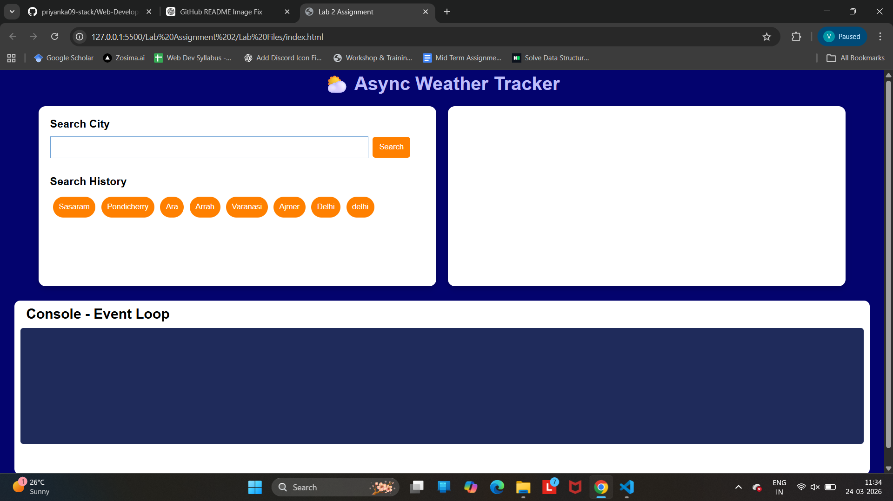
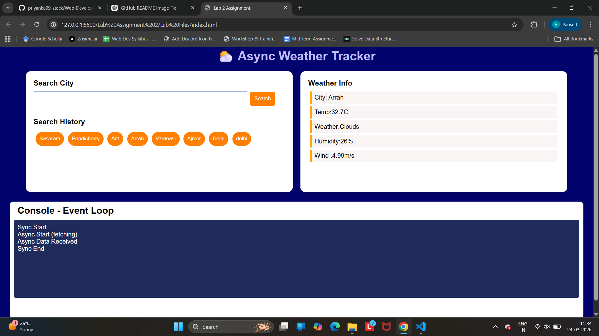
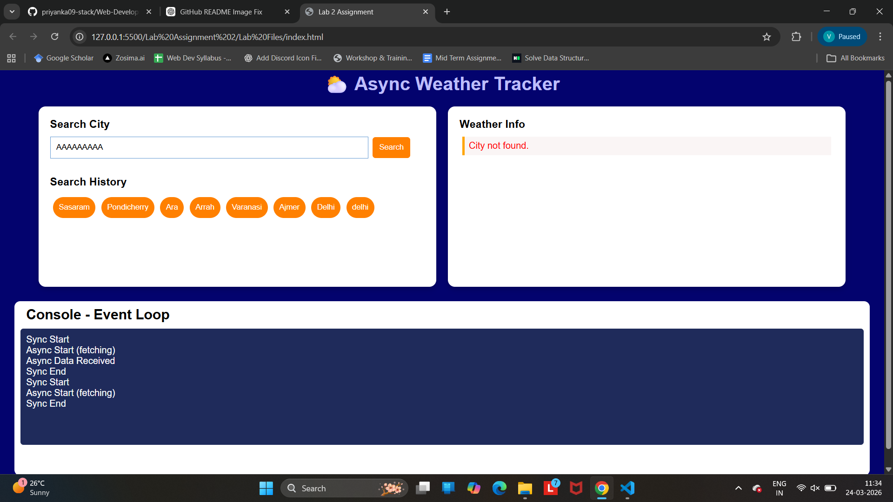

# Web-Development-II---Lab-Assignment

In this lab assignment, we used HTML, CSS & Vanilla JavaScript to make an Async Weather Tracker in which we used async/await, promises, error handling, event loop behaviour, and local storage.

## 📸 Project Screenshots

